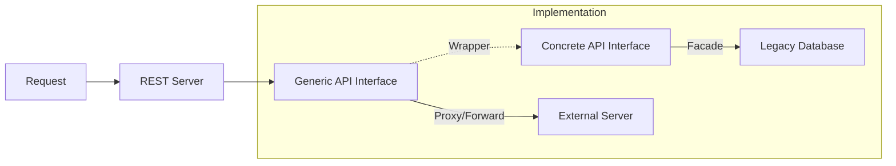

# fhir-toolbox-go

[](https://pkg.go.dev/github.com/damedic/fhir-toolbox-go)

> FHIR® is the registered trademark of HL7® and is used with the permission of HL7®.
> Use of the FHIR trademark does not constitute endorsement of the contents of this repository by HL7®.

This project provides a set of packages for working with the HL7® FHIR® standard in Go.
You only need to implement some interfaces and get a REST implementation out-of-the-box.

This includes model types and interfaces modeling capabilities that you can use to build custom FHIR® servers.
A REST server and client are provided.

> While used in production at DAMEDIC, this project is still in its early days
> and the feature set is quite limited.
> We will add features as we require them. We welcome external contributions.

## Installation

```sh
go get github.com/damedic/fhir-toolbox-go
```

## Features

- FHIR® model types with JSON and XML (un)marshaling
    - generated from the FHIR® specification
    ```go
    // Use a container struct because json.Unmarshal cannot unmarshal directly into interfaces
    var r r4.ContainedResource
    err := json.Unmarshal(data, &r)

    // Access the actual resource of type model.Resource
    res := r.Resource
  ```
- Extensible REST API with capabilities modeled as interfaces for building server
    - Capability detection by runtime type assertion (note: operations use reflection) (see [Capabilities](#capabilities))
        - alternatively: generic API for building adapters
        - automatic generation of `CapabilityStatements` with full SearchParameter integration
    - Interactions: `create`, `read`, `update`, `delete`, `search`, `$operations` (see [Roadmap](#roadmap) for the remaining
      interactions)
    - Advanced search parameter handling with full SearchParameter resource support
    - Cursor-based pagination
- Fully typed client implementation
    - Interactions: `create`, `read`, `update`, `delete`, `search`, `$operations`
- FHIRPath evaluation
	- [FHIRPath v2.0.0](https://hl7.org/fhirpath/N1/) support, including UCUM quantity conversions (see [below for more information](#fhirpath))
- R4, R4B & R5

  use build tags `r4`, `r4b` or `r5` for conditional compilation if you only need runtime support for specific
  versions

## Getting Started

A quick "getting started" tutorial for server-side can be found in the [`./examples/demo`](./examples/demo/main.go)
project.

[`./examples/client`](./examples/client/main.go) shows how the client can be used.

### Other Examples

You can find more examples in [`./examples/`](./examples/).
The [`mock`](./examples/mock/main.go) example shows how to build custom FHIR® facades on top of legacy data sources
using the concrete capabilities API, including the required `CapabilityBase` implementation.
The [`proxy`](./examples/proxy/main.go) example uses the generic API to forward all requests to another FHIR® server.

```sh
go run ./examples/proxy https://server.fire.ly/
```

This starts a simple mock-facade that forwards all requests to a test-server.

From another terminal, run

```sh
curl 'http://localhost/Patient/547'
```

or

```sh
curl 'http://localhost/Patient?_id=547'
```

to get a bundle.

## Capabilities

Everything is designed around capabilities, represented by interfaces (e.g. `PatientSearch`).
This flexible architecture allows different use cases, such as

- building FHIR® facades to legacy systems by implementing a custom backend
- using this library as a FHIR® client (via the provided REST client)

### Concrete vs. Generic API

The library provides two API *styles*.
The **concrete** API:

```Go
func (a myAPI) ReadPatient(ctx context.Context, id string) (r4.Patient, error) {}

func (a myAPI) SearchPatient(ctx context.Context, options search.Options) (search.Result, error) {}

func (a myAPI) SearchCapabilitiesPatient(ctx context.Context) (search.Capabilities[r4.SearchParameter], error) {}
```

and the **generic** API:

```Go
func (a myAPI) Read(ctx context.Context, resourceType, id string) (model.Resource, error) {}

func (a myAPI) Search(ctx context.Context, resourceType string, options search.Options) (search.Result, error) {}

func (a myAPI) CapabilityStatement(ctx context.Context) (r4.CapabilityStatement, error) {}
```

You can implement your custom backend or client either way.
The **concrete** API is ideal for building custom FHIR® facades where a limited set of resources is used (see [
`./examples/mock`](./examples/mock/main.go)).
The **generic** API is better suited for e.g. building FHIR® clients (see [
`./examples/proxy`](./examples/proxy/main.go))
or standalone FHIR® servers.



### Operations

FHIR operations are supported at system, type, and instance levels.
You can expose operations using the concrete API by providing `XyzOperationDefinition` methods and matching `InvokeXyz` methods.
The REST server auto-discovers these and surfaces them in the CapabilityStatement.


#### Concrete API example

```go
// OperationDefinition declarations
func (b *backend) PingOperationDefinition() r5.OperationDefinition {
    return r5.OperationDefinition{Id: &r5.Id{Value: ptr.To("ping")}, Code: r5.Code{Value: ptr.To("ping")}, System: r5.Boolean{Value: ptr.To(true)}}
}
func (b *backend) EchoOperationDefinition() r5.OperationDefinition {
    return r5.OperationDefinition{Id: &r5.Id{Value: ptr.To("echo")}, Code: r5.Code{Value: ptr.To("echo")}, Type: r5.Boolean{Value: ptr.To(true)}, Resource: []r5.Code{{Value: ptr.To("Patient")}}}
}
func (b *backend) HelloOperationDefinition() r5.OperationDefinition {
    return r5.OperationDefinition{Id: &r5.Id{Value: ptr.To("hello")}, Code: r5.Code{Value: ptr.To("hello")}, Instance: r5.Boolean{Value: ptr.To(true)}, Resource: []r5.Code{{Value: ptr.To("Patient")}}}
}

// Invoke methods
func (b *backend) InvokePing(ctx context.Context, params r5.Parameters) (r5.Parameters, error) { return r5.Parameters{}, nil }
func (b *backend) InvokeEcho(ctx context.Context, resourceType string, params r5.Parameters) (r5.Patient, error) { return r5.Patient{}, nil }
func (b *backend) InvokeHello(ctx context.Context, resourceType, id string, params r5.Parameters) (r5.Parameters, error) { return r5.Parameters{}, nil }
```

With these, the server exposes:
- `GET|POST /$ping`
- `GET|POST /Patient/$echo`
- `GET|POST /Patient/{id}/$hello`

And lists them in the CapabilityStatement (ping under `rest.operation`, echo/hello under Patient in `rest.resource[].operation`).

#### Client invocation

```go
// Using R4/R5 client wrappers
res, err := client.InvokeSystem(ctx, "ping", r5.Parameters{})
res, err := client.InvokeType(ctx, "Patient", "echo", r5.Parameters{ /* name, etc. */ })
res, err := client.InvokeInstance(ctx, "Patient", "123", "hello", r5.Parameters{})

// Generic interface
res, err := generic.Invoke(ctx, "", "", "ping", params)
res, err := generic.Invoke(ctx, "Patient", "", "echo", params)
res, err := generic.Invoke(ctx, "Patient", "123", "hello", params)
```

#### Typed Invoke helpers (generated)

In addition to `InvokeSystem`, `InvokeType`, and `InvokeInstance`, the client exposes generated convenience methods for spec-defined operations:

- System-level: `InvokeXxx(ctx, params)` calls `/$xxx`, e.g.:

  ```go
  // R4 terminology and conformance examples
  res, err := client.InvokeVersions(ctx, r5.Parameters{}) // /$versions
  res, err := client.InvokeClosure(ctx, r5.Parameters{})  // /$closure
  ```

- Type/Instance-level: `Invoke{Resource}Xxx(ctx, params, id ...string)` calls `/{type}/$xxx` or `/{type}/{id}/$xxx` depending on whether `id` is provided, e.g.:

  ```go
  // Patient $everything
  res, err := client.InvokePatientEverything(ctx, r5.Parameters{})           // /Patient/$everything
  res, err := client.InvokePatientEverything(ctx, r5.Parameters{}, "123")   // /Patient/123/$everything

  // ValueSet $expand
  res, err := client.InvokeValueSetExpand(ctx, r5.Parameters{})              // /ValueSet/$expand

  // Observation $lastn (type)
  res, err := client.InvokeObservationLastn(ctx, r5.Parameters{})            // /Observation/$lastn
  ```

These helpers are derived from the HL7 FHIR operations list for each release (R4, R4B, R5) during code generation and are available alongside other generated client methods.

#### CapabilityBase Requirement

**Important**: When using the concrete API, you must implement the `CapabilityBase` method:

```Go
func (a myAPI) CapabilityBase(ctx context.Context) (r5.CapabilityStatement, error) {
    return r5.CapabilityStatement{
        Status:          r5.Code{Value: ptr.To("active")},
        Kind:            r5.Code{Value: ptr.To("instance")},
        Implementation:  &r5.CapabilityStatementImplementation{
            Description: r5.String{Value: ptr.To("My FHIR Server")},
            Url:         &r5.Url{Value: ptr.To("https://my-server.com")},
        },
        // ... other metadata
    }, nil
}
```

This base CapabilityStatement is enhanced with the capabilities detected from your concrete implementation.
The `implementation.url` field is **required** as it's used to generate canonical URLs for SearchParameter references
and other fully qualified ids, e.g. in bundles.

#### SearchParameter Aggregation

The library automatically aggregates SearchParameter resources from your concrete implementations into the
CapabilityStatement. By default, SearchParameter resources are gathered in the following way:

```go
// Your backend implements Patient search capabilities
func (b MyBackend) SearchCapabilitiesPatient(ctx context.Context) (r4.SearchCapabilities, error) {
    return r4.SearchCapabilities{
        Parameters: map[string]r4.SearchParameter{
            "_id":  {Type: r4.SearchParamTypeToken},
            "name": {Type: r4.SearchParamTypeString},
            "birthdate": {Type: r4.SearchParamTypeDate},
        },
    }, nil
}

// The system automatically creates SearchParameter resources for these parameters
// Available at: GET /SearchParameter/Patient-name, /SearchParameter/Patient-birthdate, etc.
```

> **Note**: The values of the parameters map can be fully specified SearchParameter resources as defined in the standard. If you omit certain required fields like in the above example, these get augmented by the framework.

> **Attention**: If you implement `SearchParameterSearch` (the `search` interaction for the `SearchParameter` resource), you will overwrite the automatic gathering and augmentation described above.


#### Interoperability

Wrapper structs facilitate interoperability between the generic and the concrete API.

```Go
genericAPI := capabilitiesR4.Generic{Concrete: concreteAPI}
```

This adapts an implementation of the concrete interfaces so it can be served through the generic REST layer without additional glue code.
To host a concrete implementation using the REST layer, you do **not** have to call this sexplicitly.
The REST handler wraps concrete implementations for you!

and vice versa:

```Go
concreteAPI := capabilitiesR4.Concrete{Generic: genericAPI}
```

This wraps a generic implementation and exposes the strongly typed concrete interfaces (e.g. `ReadPatient`) for consumers that prefer compile-time types.

## FHIRPath

The [FHIRPath v2.0.0](https://hl7.org/fhirpath/N1/) specification is implemented, including UCUM-based quantity
conversions via the bundled [`github.com/iimos/ucum`](https://github.com/iimos/ucum) module.

The 3.0.0-ballot specification introduces additional functions and semantics (see
[FHIRPath v3.0.0 draft](https://build.fhir.org/ig/HL7/FHIRPath/index.html)).
We aim to cover most of these, but may lack behind in completeness.

The STU `Long` primitive is implemented, including literal parsing (e.g. `42L`) and the `toLong`/`convertsToLong`
conversion helpers, so consumers can work with 64-bit integers alongside the existing 32-bit `Integer` type.

From the FHIR-specific extension functions defined in the FHIR specification, the following are implemented:

* `extension(url : string) : collection` - extracts extensions by URL from FHIR elements
* `hasValue() : Boolean` - checks if a FHIR primitive has a value (not just extensions)
* `getValue() : System.[type]` - returns the primitive system value when a single FHIR primitive has a value

Other FHIR-specific functions like `resolve()` and `conformsTo()` are not yet implemented, mostly because they require validation or terminology services which are not implemented by `fhir-toolbox-go` yet.

For a quick usage example see [`./examples/fhirpath`](./examples/fhirpath/main.go).

### Decimal precision

The FHIRPath evaluation engine uses [apd.Decimal](https://pkg.go.dev/github.com/cockroachdb/apd#Decimal) under the hood.
The library sets a **default precision of 34 significant decimal digits** to comfortably exceed the
[FHIR specification requirement of at least 18 decimal digits of precision for `decimal` values](https://hl7.org/fhir/R4/datatypes.html#decimal).

Precision of decimal operations can be customized by supplying
an [apd.Context](https://pkg.go.dev/github.com/cockroachdb/apd#Context):

```Go
// Setup context
ctx := r4.Context()
// with defined precision for decimal operations.
ctx = fhirpath.WithAPDContext(ctx, apd.BaseContext.WithPrecision(100))

expr, err := fhirpath.Parse("Observation.value / 3")
if err != nil {
// Handle error
}

// Evaluate the expression against a FHIR resource
result, err := fhirpath.Evaluate(ctx, observation, expr)
if err != nil {
// Handle error
}
```

**Note**: The `precision()`, `lowBoundary()`, and `highBoundary()` functions for Decimal types are implemented and use the context's precision for calculations, with automatic precision adjustment for intermediate operations to prevent overflow.

### Testing Approach

The FHIRPath implementation is tested against the FHIRPath test suite.
Tests are downloaded on first execution and cached afterward into the `build` folder.
As the test cases XML has some inconsistencies and features not supported yet,
the tests are modified before execution in [`fhirpath/fhirpath_test.go`](fhirpath/fhirpath_test.go)

## Roadmap

- interactions
    - support for resource versioning (`vread`, `history`)
    - at some point `patch` and `batch/transaction`, but no priority at the moment
- constants for code systems and/or value-sets
- adapter for resolving `_include` and `_revinclude`
- validation of resources (also against profiles)

## Packages

| Package              | Description                                                                   |
|----------------------|-------------------------------------------------------------------------------|
| `model`              | Generated FHIR® model types                                                   |
| `capabilities/..`    | Interfaces modeling capabilities a server can provide or a client can consume |
| `capabilities/search` | Types and helper functions for implementing search capabilities               |
| `fhirpath`           | FHIRPath execution engine                                                     |                                                     
| `rest`               | FHIR® REST server implementation                                              |
| `testdata`           | Utils for loading test data and writing tests                                 |
| `examples`           | Examples on what you can do with this module                                  |

### Scope

Everything part of the FHIR® specification is in scope of this project.
However, we (DAMEDIC) do not strive for feature-completion.
Instead we will only implement what we need for building our products.
See [Contribution](#contribution) below.

## Contribution

We are happy to accept contributions.
Bugfixes are always welcomed.
For more elaborate features we appreciate commitment to maintain the contributed code.
